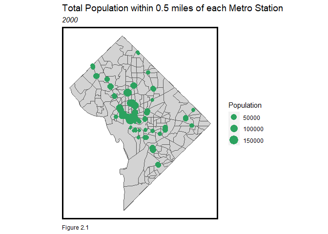
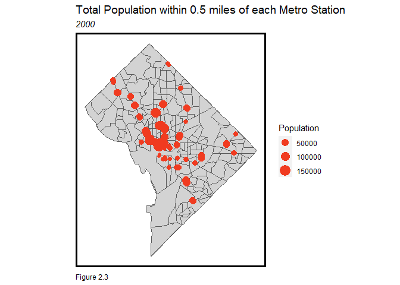

Determining the value of TOD in Washington, D.C.
================
Kayla Lumpkin
9/24/2021

## Table of Contents for Determining the value of TOD in Washington, D.C.

1.  Introduction
2.  Looking at TOD’s impact on total housing units, population, median
    rent and census tract race demographics
3.  How does TOD affect other neighborhood characteristics? +
    Population + Median Household Income + Owner-occupied property
    values + Total Living in Poverty + Recipients of SSI/Food Stamps
4.  Variations in Rent Depending on Distance from Transit Stops
5.  Are TOD Neighborhoods *Safer*?
6.  Summary of Findings
7.  Sources

# Introduction

## Load Libraries

``` r
library(tidyverse)
library(tidycensus)
library(sf)
library(tmap)
library(kableExtra)

options(scipen=999)
options(tigris_class = "sf")
census_api_key("1d63e5e6e661f6fd556f9671502bf3879e3a9fd3", overwrite = TRUE)
```

## Styling

``` r
mapTheme <- function(base_size = 12) {
  theme(
    text = element_text( color = "black"),
    plot.title = element_text(size = 14,colour = "black"),
    plot.subtitle=element_text(face="italic"),
    plot.caption=element_text(hjust=0),
    axis.ticks = element_blank(),
    panel.background = element_blank(),axis.title = element_blank(),
    axis.text = element_blank(),
    axis.title.x = element_blank(),
    axis.title.y = element_blank(),
    panel.grid.minor = element_blank(),
    panel.border = element_rect(colour = "black", fill=NA, size=2),
    strip.text.x = element_text(size = 12))
}

plotTheme <- function(base_size = 12) {
  theme(
    text = element_text( color = "black"),
    plot.title = element_text(size = 14,colour = "black"),
    plot.subtitle = element_text(face="italic"),
    plot.caption = element_text(hjust=0),
    axis.ticks = element_blank(),
    panel.background = element_blank(),
    panel.grid.major = element_line("grey80", size = 0.1),
    panel.grid.minor = element_blank(),
    panel.border = element_rect(colour = "black", fill=NA, size=2),
    strip.background = element_rect(fill = "grey80", color = "white"),
    strip.text = element_text(size=12),
    axis.title = element_text(size=12),
    axis.text = element_text(size=10),
    plot.background = element_blank(),
    legend.background = element_blank(),
    legend.title = element_text(colour = "black", face = "italic"),
    legend.text = element_text(colour = "black", face = "italic"),
    strip.text.x = element_text(size = 12)
  )
} 
```

## Quantile Breaks

``` r
qBr <- function(df, variable, rnd) {
  if (missing(rnd)) {
    as.character(quantile(round(df[[variable]],0),
                          c(.01,.2,.4,.6,.8), na.rm=T))
  } else if (rnd == FALSE | rnd == F) {
    as.character(formatC(quantile(df[[variable]]), digits = 3),
                 c(.01,.2,.4,.6,.8), na.rm=T)
  }
}

q5 <- function(variable) {as.factor(ntile(variable, 5))}
```

## Set Color Palette

``` r
palette5 <- c("#feebe2","#fbb4b9","#f768a1","#c51b8a","#7a0177")
```

## ACS Data Used

``` r
# Selected Variables for 2000 Dec and 2019 ACS: Tenure (Total owner occupied, renter Occupied), Median HH Income, Median Rent, Total Population, Total Housing Units, Total HH Below100p Poverty, and Number of Black Residents

#2000 Census Data Pull 

dcTracts00 <-  
  get_decennial(geography = "tract", variables = c("P053001","H056001","P001001",
                                             "P092001","H007001","H007002","H007003",
                                             "P006003"), 
                year=2000, state=11, county=001, geometry=T) %>% 
  st_transform('ESRI:102685')
```

    ## Getting data from the 2000 decennial Census

    ## Downloading feature geometry from the Census website.  To cache shapefiles for use in future sessions, set `options(tigris_use_cache = TRUE)`.

    ## Variables not found in Summary File 1. Trying Summary File 3...

    ##   |                                                                              |                                                                      |   0%  |                                                                              |====                                                                  |   6%  |                                                                              |=================================================                     |  69%  |                                                                              |======================================================================| 100%

``` r
#2019 ACS Data Pull 

dcTracts19 <-  
  get_acs(geography = "tract", variables = c("B19013_001E",  "B25058_001E","B01003_001E","B25001_001E","B06012_002E", "B25026_002E","B25026_009E", "B02001_003E"), 
                year=2019, state=11, county=001, geometry=T) %>% 
  st_transform('ESRI:102685')
```

    ## Getting data from the 2015-2019 5-year ACS

    ## Downloading feature geometry from the Census website.  To cache shapefiles for use in future sessions, set `options(tigris_use_cache = TRUE)`.

    ##   |                                                                              |                                                                      |   0%  |                                                                              |===                                                                   |   4%  |                                                                              |================================                                      |  46%  |                                                                              |===============================================                       |  67%  |                                                                              |======================================================================| 100%

``` r
#This policy brief is better suited to analyze the data in question when it has been spread into the Wide form

#Conversion of 2000 Dec Census Data to Wide Form 

dcTracts00 <- 
  dcTracts00 %>%
  dplyr::select( -NAME) %>%
  spread(variable, value) %>%
  dplyr::select(-geometry) %>%
  rename(MedHHInc = P053001, 
         MedRent = H056001,
         TotalPop = P001001, TotalHHbPov = P092001, 
         NumberBlk = P006003, 
         TotalOHU = H007001,
         TotalOO = H007002, TotalRO = H007003)

#Conversion of 2019 ACS Census Data to Wide Form 

dcTracts19 <- 
  dcTracts19 %>%
  dplyr::select( -NAME, -moe) %>%
  spread(variable, estimate) %>%
  dplyr::select(-geometry) %>%
  rename(MedHHInc = B19013_001, 
         MedRent = B25058_001,
         TotalPop = B01003_001, TotalHHbPov = B06012_002, 
         NumberBlk = B02001_003, 
         TotalOHU = B25001_001,
         TotalOO = B25026_002, TotalRO = B25026_009)

#Creating New variables

#2000 Census 

dcTracts00 <- 
  dcTracts00 %>%
  mutate(pctBlk = ifelse(TotalPop > 0, NumberBlk / TotalPop, 0),
         pctRenter = ifelse(TotalOHU > 0, TotalRO / TotalOHU, 0), pctOwner = ifelse(TotalOHU > 0, (TotalOO / TotalOHU), 0),
         pctPoverty = ifelse(TotalPop > 0, TotalHHbPov / TotalPop, 0),
         year = "2000") %>%
  dplyr::select(-NumberBlk,-TotalHHbPov)

#2019 ACS 

dcTracts19 <- 
  dcTracts19 %>%
  mutate(pctBlk = ifelse(TotalPop > 0, NumberBlk / TotalPop, 0),
         pctRenter = ifelse(TotalOHU > 0, TotalRO / TotalOHU, 0), pctOwner = ifelse(TotalOHU > 0, (TotalOO / TotalOHU), 0),
         pctPoverty = ifelse(TotalPop > 0, TotalHHbPov / TotalPop, 0),
         year = "2019") %>%
  dplyr::select(-NumberBlk,-TotalHHbPov)

#Combining 2000 and 2019 Census Data

allTracts <- rbind(dcTracts00,dcTracts19)
```

## WMATA Transit Stops

``` r
metro_stops <- 
  st_read("/Users/kmlum/OneDrive/Documents/GitHub/TODassignment/Metro_Lines.geojson") %>% 
  st_transform(st_crs(allTracts))
```

    ## Reading layer `Metro_Lines' from data source 
    ##   `C:\Users\kmlum\OneDrive\Documents\GitHub\TODassignment\Metro_Lines.geojson' 
    ##   using driver `GeoJSON'
    ## Simple feature collection with 6 features and 5 fields
    ## Geometry type: LINESTRING
    ## Dimension:     XY
    ## Bounding box:  xmin: -77.08577 ymin: 38.83827 xmax: -76.91328 ymax: 38.97979
    ## Geodetic CRS:  WGS 84

## Map of All D.C. Metro Stops

``` r
ggplot() + 
  geom_sf(data=st_union(dcTracts19)) +
  geom_sf(data=metro_stops, 
          aes(colour = NAME), 
          show.legend = "point", size= 2) +
  scale_colour_manual(values = c("blue","green","orange","red","black","yellow")) +
  labs(title="Metro Stops", 
       subtitle="Washington, D.C.", 
       caption="Figure 1") +
  mapTheme()
```

<!-- -->

## Defining TOD vs. Non-TOD

``` r
#Set a Buffer Zone
metro_buffers <- 
  rbind(
    st_buffer(metro_stops, 2640) %>%
      mutate(Legend = "Buffer") %>%
      dplyr::select(Legend),
    st_union(st_buffer(metro_stops, 2640)) %>%
      st_sf() %>%
      mutate(Legend = "Unioned Buffer"))

buffer <- filter(metro_buffers, Legend == "Unioned Buffer")

#Select by Centroids

selectCentroids <- 
  st_centroid(allTracts)[buffer,] %>% 
  st_drop_geometry() %>%
  left_join(dplyr::select(allTracts,GEOID)) %>%
  st_sf() %>%
  dplyr::select(year,TotalPop, MedRent,TotalOHU) %>%
  mutate(Selection_Type = "Select by Centroids")
```

    ## Warning in st_centroid.sf(allTracts): st_centroid assumes attributes are
    ## constant over geometries of x

    ## Joining, by = "GEOID"

``` r
#2000

selectCentroids00 <- 
  st_centroid(dcTracts00)[buffer,] %>% 
  st_drop_geometry() %>%
  left_join(dplyr::select(dcTracts00, GEOID)) %>%
  st_sf() %>%
  dplyr::select(year,TotalPop, MedRent,TotalOHU) %>%
  mutate(Selection_Type = "Select by Centroids")
```

    ## Warning in st_centroid.sf(dcTracts00): st_centroid assumes attributes are
    ## constant over geometries of x

    ## Joining, by = "GEOID"

``` r
#2019

selectCentroids19 <- 
  st_centroid(dcTracts19)[buffer,] %>% 
  st_drop_geometry() %>%
  left_join(dplyr::select(dcTracts19, GEOID)) %>%
  st_sf() %>%
  dplyr::select(year,TotalPop, MedRent,TotalOHU) %>%
  mutate(Selection_Type = "Select by Centroids")
```

    ## Warning in st_centroid.sf(dcTracts19): st_centroid assumes attributes are
    ## constant over geometries of x

    ## Joining, by = "GEOID"

# Looking at TOD’s impact on total housing units, population, and median rent

``` r
#This next portion of the policy brief will concentrate on data comparisons made between TOD and non-TOD areas. We defined TOD areas as census tracts in D.C. within a half mile of a WMATA metro line. To investigate if TOD areas are truly more desirable to Washingtonians, we will look at the changes in total housing units, population, as well as median rent from 2000 to 2019.

#Identifying census tracts within a half-mile buffer zone 

allTracts.group <- 
  rbind(
    st_centroid(allTracts)[buffer,] %>%
      st_drop_geometry() %>%
      left_join(allTracts) %>%
      st_sf() %>%
      mutate(TOD = "TOD"),
    st_centroid(allTracts)[buffer, op = st_disjoint] %>%
      st_drop_geometry() %>%
      left_join(allTracts) %>%
      st_sf() %>%
      mutate(TOD = "Non-TOD")) %>%
  mutate(MedRent.inf = ifelse(year == "2000", MedRent * 1.4847, MedRent))
```

    ## Warning in st_centroid.sf(allTracts): st_centroid assumes attributes are
    ## constant over geometries of x

    ## Joining, by = c("GEOID", "TotalOHU", "TotalOO", "TotalRO", "MedRent", "TotalPop", "MedHHInc", "pctBlk", "pctRenter", "pctOwner", "pctPoverty", "year")

    ## Warning in st_centroid.sf(allTracts): st_centroid assumes attributes are
    ## constant over geometries of x

    ## Joining, by = c("GEOID", "TotalOHU", "TotalOO", "TotalRO", "MedRent", "TotalPop", "MedHHInc", "pctBlk", "pctRenter", "pctOwner", "pctPoverty", "year")

``` r
#Our first indicator that we will look at from 2000 and 2019 is the total population. If areas near transit are deemed more attractive, consumers renting and purchasing housing units will have likely relocated to TOD areas, and therefore may have increased the number of total population along metro stop lines. 

#Arrange 2000 and 2019 Indicators 

cent00_pop <- st_centroid(selectCentroids00[,2])
```

    ## Warning in st_centroid.sf(selectCentroids00[, 2]): st_centroid assumes
    ## attributes are constant over geometries of x

``` r
cent19_pop <- st_centroid(selectCentroids19[,2])
```

    ## Warning in st_centroid.sf(selectCentroids19[, 2]): st_centroid assumes
    ## attributes are constant over geometries of x

``` r
cent_pop <- rbind(selectCentroids00[,1:2], selectCentroids19[,1:2]) 
cent_pop.group <- st_centroid(cent_pop)
```

    ## Warning in st_centroid.sf(cent_pop): st_centroid assumes attributes are constant
    ## over geometries of x

``` r
cent00_mre <- st_centroid(selectCentroids00[,3])
```

    ## Warning in st_centroid.sf(selectCentroids00[, 3]): st_centroid assumes
    ## attributes are constant over geometries of x

``` r
cent19_mre <- st_centroid(selectCentroids19[,3])
```

    ## Warning in st_centroid.sf(selectCentroids19[, 3]): st_centroid assumes
    ## attributes are constant over geometries of x

``` r
cent_med_rent <- rbind(selectCentroids00[,c(1,3)], selectCentroids19[,c(1,3)]) 
cent_med_rent.group <- st_centroid(cent_med_rent)
```

    ## Warning in st_centroid.sf(cent_med_rent): st_centroid assumes attributes are
    ## constant over geometries of x

``` r
cent00_ohu <- st_centroid(selectCentroids00[,4])
```

    ## Warning in st_centroid.sf(selectCentroids00[, 4]): st_centroid assumes
    ## attributes are constant over geometries of x

``` r
cent19_ohu <- st_centroid(selectCentroids19[,4])
```

    ## Warning in st_centroid.sf(selectCentroids19[, 4]): st_centroid assumes
    ## attributes are constant over geometries of x

``` r
cent_ohu <- rbind(selectCentroids00[,c(1,4)], selectCentroids19[,c(1,4)]) 
cent_ohu.group <- st_centroid(cent_ohu)
```

    ## Warning in st_centroid.sf(cent_ohu): st_centroid assumes attributes are constant
    ## over geometries of x

``` r
#Total Population Over Time

ggplot() + 
  geom_sf(data=st_union(allTracts.group)) +
  geom_sf(data=buffer, fill="white") +
  geom_sf(data=cent_pop.group, aes(size = TotalPop),shape = 21, color = "transparent",
          fill = "darkblue", alpha = 1, show.legend = "point") +
  scale_size_continuous(range = c(0.01,4)) +
  facet_wrap(~year)
```

<!-- -->

``` r
  labs(title="Total Population, 2000 - 2019", 
       subtitle="Washington, D.C.", 
       caption="Figure 2.5") +
  mapTheme()
```

    ## NULL

``` r
#The second indicator we'll look at is median rent over time from 2000 to 2019. We have adjusted median rent values from 2000 for inflation to 2019 numbers. 

#Median Rent Over Time 
  
ggplot() + 
  geom_sf(data=st_union(allTracts.group)) +
  geom_sf(data=buffer, fill="white") +
  geom_sf(data=cent_med_rent.group, aes(size = MedRent),shape = 21, color = "transparent",
          fill = "lightblue", alpha = 1, show.legend = "point") +
  scale_size_continuous(range = c(0.01,4)) +
  facet_wrap(~year)
```

    ## Warning: Removed 2 rows containing missing values (geom_sf).

<!-- -->

``` r
  labs(title="Median Rent, 2000 - 2019", 
       subtitle="Washington, D.C.", 
       caption="Figure 2.5") +
  mapTheme()
```

    ## NULL

``` r
#Our third indicator that we will look at from 2000 and 2019 is the total number of occupied housing units. If areas near transit are deemed more attractive, then developers will have likely recognized consumers' renting and purchasing patterns, and may have rapidly increased the number of housing units along metro stop lines. 

#Total Occupied Housing Units in TOD Areas in 2000 and 2019 

ggplot() + 
  geom_sf(data=st_union(allTracts.group)) +
  geom_sf(data=buffer, fill="white") +
  geom_sf(data=cent_ohu.group, aes(size = TotalOHU),shape = 21, color = "transparent",
          fill = "red", alpha = 1, show.legend = "point") +
  scale_size_continuous(range = c(0.01,4)) +
  facet_wrap(~year)
```

<!-- -->

``` r
  labs(title="Total Occupied Housing Units, 2000 - 2019", 
       subtitle="Washington, D.C.", 
       caption="Figure 2.5") +
  mapTheme()
```

    ## NULL
